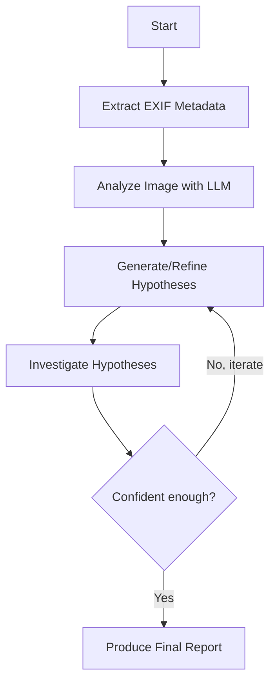

# Geolocation Agent Build Plan

## Architecture

The agent follows a **state-machine pattern** powered by LangGraph. It iteratively moves through phases of analysis, hypothesis generation, investigation, and verification -- looping back when new evidence emerges.




The **Investigate** node has access to ALL tools -- web search, reverse image search, places lookup, AND maps/satellite/street view. Geospatial verification is not a separate phase; it is part of the investigation loop. The agent can pull up Street View to test a hypothesis on iteration 2 just as easily as it can run a web search on iteration 1. Maps verification is simply one of many evidence-gathering techniques available during investigation.

Each node in the graph binds relevant tools to the LLM and lets it reason + call tools autonomously. The agent state accumulates clues, hypotheses, candidates, and evidence across iterations.

## Project Structure

```
geolocation-agent/
├── pyproject.toml                    # UV project config + dependencies
├── .env.example                      # API key template
├── src/
│   └── geolocation_agent/
│       ├── __init__.py
│       ├── agent.py                  # LangGraph graph definition
│       ├── state.py                  # AgentState TypedDict
│       ├── config.py                 # Settings (pydantic-settings, multi-provider)
│       ├── prompts.py                # System prompts for each phase
│       ├── nodes.py                  # LangGraph node functions
│       ├── tools/
│       │   ├── __init__.py           # Tool registry
│       │   ├── image_tools.py        # crop, zoom, adjust, EXIF, OCR
│       │   ├── search_tools.py       # web_search (Tavily), reverse_image_search (SerpAPI Google Lens)
│       │   ├── maps_tools.py         # satellite, street_view, geocode, reverse_geocode
│       │   ├── places_tools.py       # Google Maps Places nearby/text search
│       │   └── evidence_tracker.py   # Structured memory: clues, hypotheses, evidence
│       └── models/
│           ├── __init__.py
│           ├── clues.py              # Clue pydantic models
│           ├── hypotheses.py         # Hypothesis pydantic models
│           └── evidence.py           # Evidence, Candidate, FinalAnswer models
├── tests/
│   ├── conftest.py                   # Shared fixtures, test image
│   ├── test_image_tools.py
│   ├── test_search_tools.py
│   ├── test_maps_tools.py
│   ├── test_places_tools.py
│   ├── test_evidence_tracker.py
│   ├── test_agent.py                 # Integration test of full agent run
│   └── fixtures/
│       └── test_image.jpg            # Sample image for testing
├── plans/                            # Saved execution plans
├── docs/
│   ├── architecture.md
│   ├── tools-reference.md
│   └── decisions.md
└── .gitignore
```

## Key Dependencies

- `langgraph`, `langchain-core` -- agent state machine
- `langchain-anthropic`, `langchain-openai`, `langchain-google-genai` -- multi-provider LLM
- `tavily-python` -- Tavily client for web search
- `google-search-results` -- SerpAPI client (Google Lens reverse image search)
- `googlemaps` -- Google Maps Platform client
- `Pillow` -- image crop/zoom/adjust
- `exifread` -- EXIF metadata extraction
- `pydantic`, `pydantic-settings` -- data models and config
- `httpx` -- async HTTP client for API calls
- `pytest`, `pytest-asyncio` -- testing

## State Design (`state.py`)

The core `AgentState` tracks everything across iterations:

```python
class AgentState(TypedDict):
    image_path: str
    side_info: str
    messages: Annotated[list[BaseMessage], add_messages]
    clues: list[dict]          # extracted visual clues
    hypotheses: list[dict]     # ranked hypotheses
    candidates: list[dict]     # candidate locations
    evidence_log: list[dict]   # for/against evidence per candidate
    eliminated: list[dict]     # ruled-out candidates with reasons
    iteration: int
    max_iterations: int
    phase: str
    confidence: float
    final_answer: Optional[dict]
```

## Agent Behavior Guide (`prompts.py` -- core system prompt)

This is the foundational document that defines how the agent thinks and acts. Written early because the nodes, graph, and phase prompts all flow from it. Lives in `prompts.py` as the `SYSTEM_PROMPT` constant.

The behavior guide covers:

### Identity and Goal

- You are a geolocation agent. Your task is to determine the real-world location where a photograph was taken, as precisely as the available evidence allows.

### Reasoning Discipline

- Work iteratively. Never jump from a single clue to a precise location.
- Treat early matches as hypotheses, not conclusions.
- Require independent confirmation from at least two different evidence sources before increasing confidence.
- Keep eliminated candidates in the evidence log with reasons -- never silently discard.
- Make uncertainty explicit at all times.

### Workflow Stages

The agent's natural rhythm, expressed as guidance not rigid rules:

1. **Extract** -- inspect the image for text, signs, brands, architecture, vegetation, terrain, road markings, weather, lighting, interior objects. Record each as a structured clue.
2. **Hypothesize** -- from the clue set, propose ranked hypotheses at multiple levels: country/region, place type (winery, hotel, lookout, etc.), and specific venue if evidence warrants.
3. **Investigate** -- use ALL available tools to gather evidence for and against each hypothesis. This includes web search, reverse image search, places lookup, AND maps/satellite/street view. Geospatial verification is investigation, not a separate phase. Sub-hypotheses are encouraged (e.g. "this tree species is common in region X" supports the parent hypothesis "photo is in region X").
4. **Report** -- when confident or when iterations are exhausted, produce a structured final answer.

### Tool Usage Rules

- Use image crop and zoom aggressively to inspect fine details (signs, text, logos, plates).
- Use reverse image search on cropped regions, not just the full image.
- When web searching, combine multiple clue dimensions (region + venue type + distinctive object).
- Use maps/satellite/street view at any point during investigation to test a hypothesis -- don't wait until you're "sure enough."
- Always record evidence in the evidence tracker before moving on.

### Evidence Standards

- A hypothesis with only one supporting clue remains "speculative."
- A hypothesis with two independent supporting clues is "plausible."
- A hypothesis with three+ independent supporting clues and geospatial confirmation is "confident."
- Conflicting evidence must be explicitly acknowledged and weighed.

### Output Format

At each investigation cycle, the agent produces:

- **Extracted Clues** -- bullet list of image-derived facts
- **Current Hypotheses** -- ranked with reasons
- **Evidence Log** -- what supports and contradicts each candidate
- **Next Steps** -- highest-value actions to take
- **Confidence** -- separate confidence for region, place type, and exact venue

### Operating Rules

- Do not hallucinate locations. If you cannot determine the location, say so.
- Prefer a correct "somewhere in southern France" over a wrong specific address.
- When stuck, try a different tool or angle rather than repeating the same approach.
- Use cropped reverse image search as a high-value default when the full image yields nothing.

## Tool Details

### 1. Image Tools (`image_tools.py`)

- `crop_image(image_path, x, y, width, height)` -- crop a region, return new path
- `zoom_image(image_path, x, y, zoom_factor)` -- zoom into a point, return new path
- `adjust_image(image_path, brightness, contrast, sharpness)` -- enhance, return new path
- `extract_exif(image_path)` -- return all EXIF metadata as dict (GPS, camera, timestamp)
- `ocr_region(image_path, x, y, width, height)` -- crop then send to LLM for text extraction

### 2. Search Tools (`search_tools.py`)

- `web_search(query, num_results=10)` -- Tavily search, returns title/snippet/URL with relevance scoring
- `reverse_image_search(image_url)` -- SerpAPI Google Lens, returns visual matches
- `reverse_image_search_region(image_path, x, y, w, h)` -- crop, upload to temporary host, then reverse search via Google Lens

### 3. Maps Tools (`maps_tools.py`)

- `get_satellite_image(lat, lng, zoom, size)` -- Google Maps Static API satellite tile
- `get_street_view(lat, lng, heading, pitch, fov)` -- Google Street View Static API
- `geocode(address)` -- address to lat/lng
- `reverse_geocode(lat, lng)` -- lat/lng to address

### 4. Places Tools (`places_tools.py`)

- `search_places_nearby(lat, lng, radius, type, keyword)` -- Google Places Nearby Search
- `search_places_text(query)` -- Google Places Text Search
- `get_place_details(place_id)` -- full place info including photos

### 5. Evidence Tracker (`evidence_tracker.py`)

- `add_clue(description, source, confidence)` -- record an extracted clue
- `add_hypothesis(description, region, place_type, reasoning, confidence)` -- record a hypothesis
- `add_candidate(name, lat, lng, hypothesis_id, evidence_for, evidence_against)` -- record a candidate
- `eliminate_candidate(candidate_id, reason)` -- move to eliminated list
- `update_confidence(candidate_id, new_confidence, reason)` -- adjust ranking
- `get_investigation_summary()` -- formatted summary for LLM context

## Agent Graph Nodes (`nodes.py`)

1. `**extract_metadata`** -- Runs `extract_exif`, checks for GPS shortcut, records clues
2. `**analyze_image**` -- LLM inspects image with vision, records structured clues
3. `**generate_hypotheses**` -- LLM proposes/refines region/venue hypotheses from accumulated clues and evidence
4. `**investigate**` -- LLM picks from ALL tools (web search, reverse image search, places, maps, satellite, street view) to test hypotheses. This is where geospatial verification happens -- it is part of the investigation, not a separate step
5. `**should_continue**` -- Conditional edge: checks confidence threshold and iteration count
6. `**produce_report**` -- Generates final answer with confidence, evidence, alternatives

## Multi-Provider LLM (`config.py`)

Configuration via environment variables:

- `LLM_PROVIDER` = `anthropic` | `openai` | `google`
- `OPENAI_API_KEY` (required -- primary provider)
- `ANTHROPIC_API_KEY` (optional -- for Claude provider)
- `GOOGLE_API_KEY` (optional -- for Gemini provider, separate from Maps key)
- `TAVILY_API_KEY` (required -- web search)
- `SERPAPI_API_KEY` (required -- reverse image search via Google Lens)
- `GOOGLE_MAPS_API_KEY` (required -- maps, satellite, street view, places, geocoding)

A factory function returns the appropriate `ChatModel` with vision support.

## Testing Strategy

- **Unit tests per tool module** -- mock external APIs, verify input/output shapes
- **Evidence tracker tests** -- pure logic, no mocks needed
- **Image tools tests** -- use a fixture image, verify crop/zoom produce valid images
- **Integration test** -- mock all APIs, run a full agent cycle, verify state transitions
- Each test file is self-contained with clear assertions

## Documentation

- `docs/architecture.md` -- system design, state flow, graph structure
- `docs/tools-reference.md` -- every tool with parameters, return types, examples
- `docs/decisions.md` -- key design decisions and rationale

